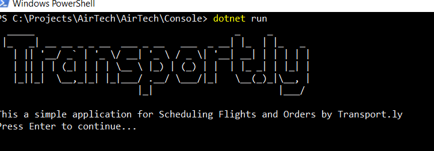

# transport.ly
Simple application to load flights and orders (Air-Tech code assestment)

### Framework and Libraries 

- .NET Core 3.1 SDK
- . Figgle

### Use

- For Development, simply open powershell or cmd and run "dotnet run"
- For Release, make sure to copy the order.json to the root directory

